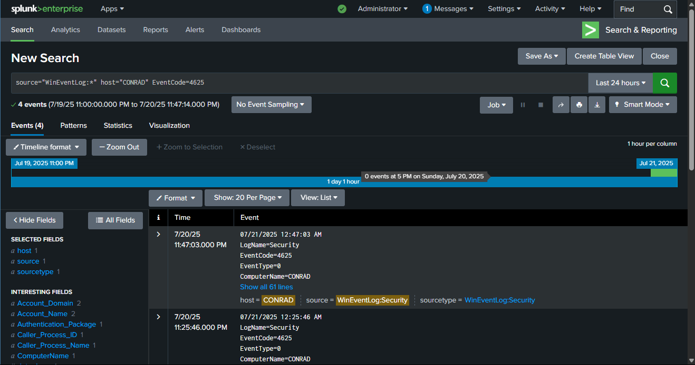
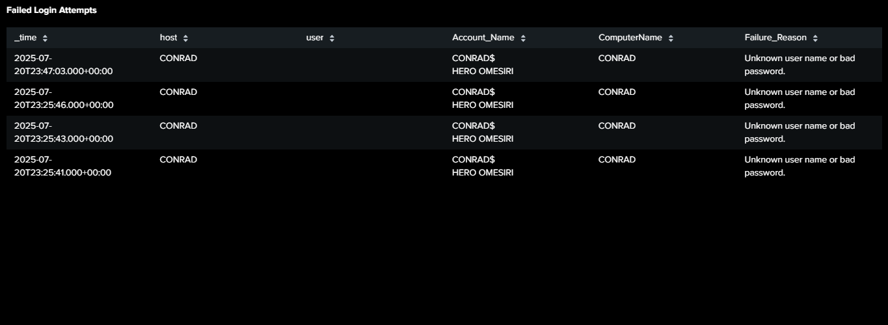
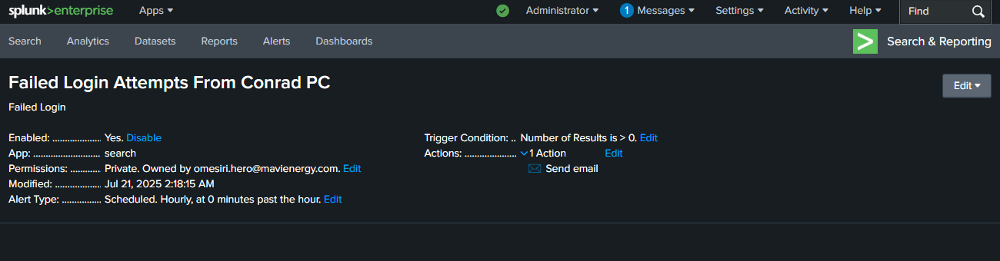
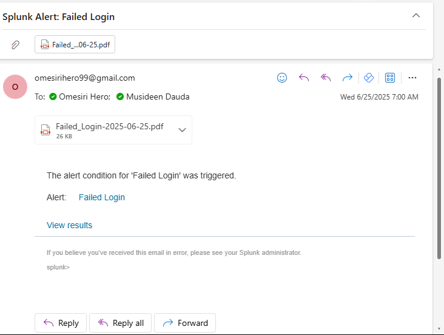

# Windows Login Failure Monitoring with Splunk

This project demonstrates how to detect and monitor failed Windows logon attempts (Event ID 4625) using **Splunk**. It includes steps to ingest Windows Event Logs, run SPL queries, build dashboards, and create alerts for suspicious login activity.

---

## Project Objective

Build a simple log monitoring setup to detect brute-force or unauthorized access attempts on a local Windows system, with automated alerts and visual dashboards.

---

## Tools & Technologies

| Tool         | Description                     |
|--------------|---------------------------------|
| **Splunk**   | Log analysis and SIEM platform  |
| **Windows OS** | Source of security event logs   |
| **SPL (Search Processing Language)** | Query language for Splunk |

---

## Setup Guide (Step-by-Step)

### 1. Enable Windows Event Logging
Ensure your system logs Security events:
- Press `Win + R` → type `eventvwr` → Enter
- Navigate to **Windows Logs > Security**

### 2. Install Splunk
- Download from: [https://www.splunk.com](https://www.splunk.com)
- Install Splunk Enterprise and launch via browser: `http://localhost:8000`

### 3. Add Data Source
- Select **Add Data > Monitor**
- Choose `Local Event Logs` > Select `Security`
- Name the source and confirm indexing

### 4. Run SPL Query for Failed Logins
Use this query in Splunk Search:

```spl
source="WinEventLog:*" host="CONRAD" EventCode=4625
| table _time, user, host, Logon_Type, WorkstationName, FailureReason
| sort -_time
 ```



### 5. Dashboard Creation
- After running the SPL query,Click Save As > New Dashboard
- Chosse Dashboard Studio
- Use Grid Layout for Flexible arrangement
- Add a panel with the above SPL query
- Add description for context
- Click Save
  

  
### 6.Create Alert for Failed Logins
- Run your SPL query
- Click Save As > Alert
Set the following:
- Title: Failed Login Alert
- Trigger condition: if number of results > 0
- Schedule: Every 1 hour (or as needed)
- Trigger actions: Add Email notification (or Log to file)
- Save the alert

  
  
- Alert Received via email after failed Login Attempts
  
  

Screenshots


